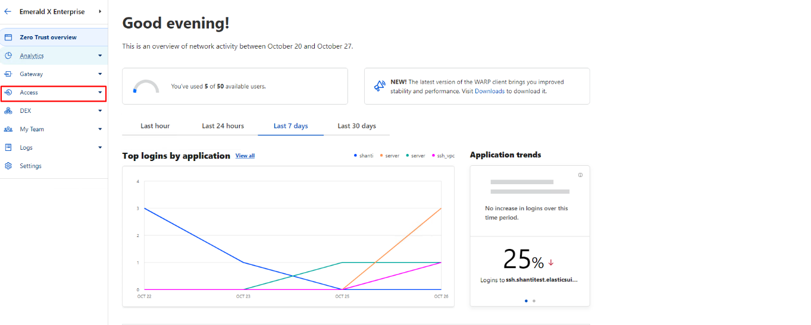
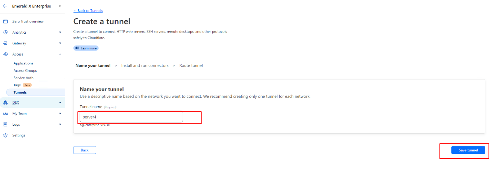
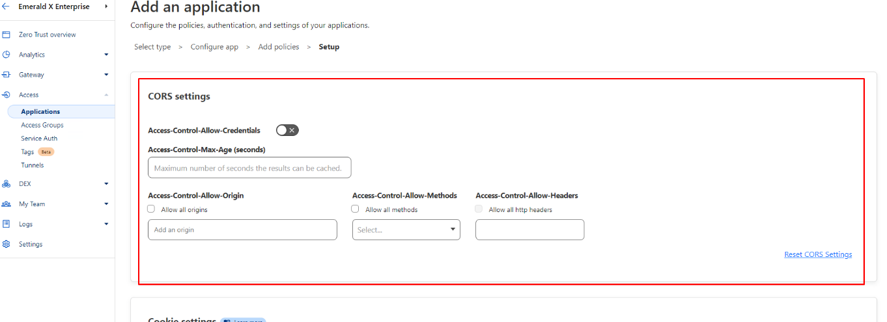

# Zero Trust Implementation

---

## Table of Contents

1. [Cloudflare Tunnel Configuration](#cloudflare-tunnel-configuration)
2. [Application and Policy Configuration](#application-and-policy-configuration)
3. [Tunnel Access Through Native Terminal](#tunnel-access-through-native-terminal)
4. [Conclusion](#conclusion)

---

## Cloudflare Tunnel Configuration

1. Open the DNS section of your domain upon which you want to configure zero trust.

2. Make sure you have A records pointing towards your origin server.

   

3. Navigate to the zero-trust icon in your enterprise account.

   

4. In zero trust, open the access section.

   

5. Then click on the tunnel option to create a new tunnel.

   

6. Put the name in the tunnel name field and save the tunnel.

   

7. Then, you will have to choose the operating system; in our case, we are choosing Debian, and then copy the command on
   the left side.

   

8. Copy the command into the server machine and run it.

   

9. Make sure the connector shows the status of connected.

   

10. Fill the fields in the route tunnel section as follows:
    - Fill the subdomain field with `ssh`.
    - Fill the domain section with your domain name, like `devopstest.elasticsuite.com`.
    - Navigate to the dropdown menu under the Type section.
    - Put the type SSH with port 22 in the section like `localhost:22`.
    - Save the tunnel.

      

---

## Application and Policy Configuration

1. Navigate to the application section and click on the "add an application" button.

   

2. Select "Self-hosted" under the "add an application" section.

   

3. Fill the fields under the application configuration section:
   - Fill the field under the Application name with any name of your choice.
   - Choose the session duration under the dropdown menu as required.
   - Fill the section in the Application subdomain with `ssh`.
   - Fill the domain like `devopstest.elasticsuite.com` under the Domain field.

     
     

4. After scrolling down, make sure the "Accept all available identity providers" toggle button is on, and then select
   the next button.

   

5. After performing all steps, now you are in the "add policies" section:
   - In the "add policies" section, put the policy name of your own choice.
   - Select the action as "allow".
   - Navigate to the "configure rules" section.
   - Select the rule under the include section of the selector field. In existing, we have chosen emails ending in
     option to allow company domain email access only.
   - Under the value field, put your SSO email like `@emraldexpo.com`.

     

6. Scroll down and select the next button.

   
   

7. In the setup section, keep all toggle buttons on default settings.

8. After scrolling down, just click on the "add application" button.

   

---

## Tunnel Access Through Native Terminal

1. Install `cloudflared` by using the following commands in your client machine:

   ```
   curl -L --output cloudflared.deb https://github.com/cloudflare/cloudflared/releases/latest/download/cloudflared-linux-amd64.deb &&  
   sudo dpkg -i cloudflared.deb
   ```

   

2. After successful installation of `cloudflared`, put the below command in your client machine to open the SSH config
   file with vim editor:

   ```
   vim ~/.ssh/config
   ```

   

3. Put the following commands in the client machine in the SSH config file and save the file:

   ```
   Host ssh.devopstest.elasticsuite.com
   ProxyCommand /usr/local/bin/cloudflared access ssh –hostname %h
   ```
   
   

4. Generate a public/private key pair in the client machine by using the following command:

   ```
   ssh-keygen -t rsa -f ~/.ssh/aws_ssh -C ubuntu
   ```

   Note: `aws_ssh` is your private key file name and `ubuntu` is your username of the machine.

   

5. When the key is generated, open the public key file by using the following command, then copy the key:

   ```
   cat ~/.ssh/aws_ssh.pub
   ```

   Note: `aws_ssh.pub` is your public key file name.

   

6. Copy the public key file text to paste that in the server's `authorized_keys` file:

   ```
   cd ~/.ssh
   sudo nano authorized_keys
   ```
   
   

7. Just paste the keys in the server machine that you copied from the client machine previously.

   

8. Then give permissions to the `aws_ssh` private key by using the below-mentioned command:

    ```
    sudo chmod 600 aws_ssh
    ```

   

9. Then navigate to the client machine and access the server by putting the following command in the client machine:

   ```
   ssh -i /home/ubuntu/.ssh/aws_ssh ubuntu@ssh.devopstest.elasticsuite.com
   ```

   

10. Copy the URL from the terminal and paste it into a browser and authenticate yourself as configured in the policy.

    

11. Now put the one-time pin in the field or authenticate with Azure AD IDP.

    

12. Your access has been approved.

    

13. You will automatically have access to the machine by key authentication.

---

## Conclusion

We have successfully configured zero trust with browser rendering and native terminal method.